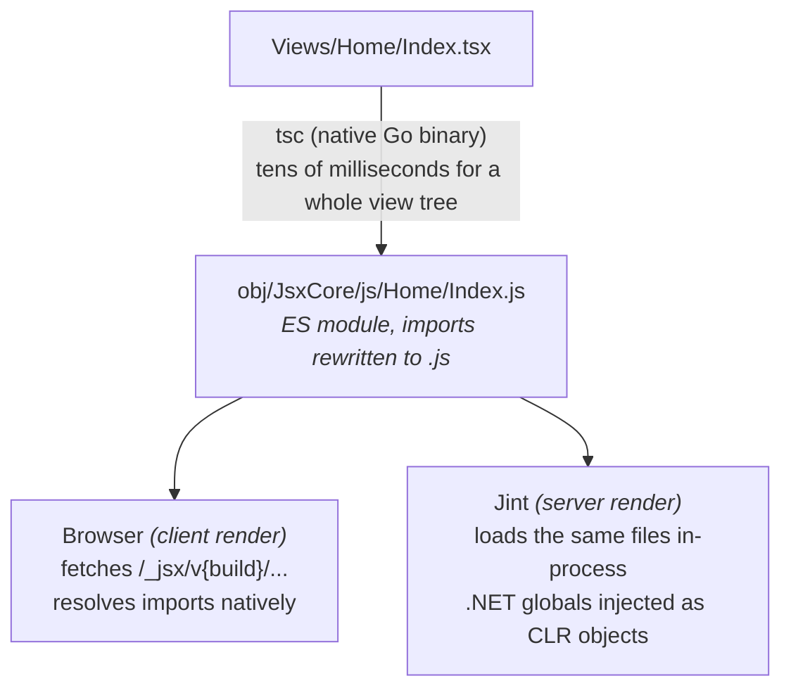

# How it works

← [Documentation index](README.md)

---

## Why this exists

Razor is excellent at server rendering and poor at interactivity. A separate SPA is excellent at
interactivity and drags in a build pipeline, a second router, and a serialisation boundary you now
maintain by hand.

JsxCore takes the middle path. Views are components. The same component can render on the server
for first paint and SEO, or in the browser for interactivity, or both, chosen per response. The
model flows from your endpoint into the component either way, and its TypeScript type is generated
from the C#, so the two cannot drift.

---

## The pipeline



Both sides load **the same compiled files**. There is no separate server bundle and no separate
client bundle, so a component cannot behave differently depending on which one ran.

---

## No bundler

The three things that usually make this kind of tool heavy are all absent.

### Compilation is a native binary

TypeScript 7 is the Go port of the compiler, published as platform-specific native executables
under `node_modules/@typescript/typescript-{os}-{arch}/lib/tsc`. JsxCore locates that binary and
runs it as a process.

JsxCore fetches that package from the registry itself, so **Node is not needed to obtain it and
nothing runs on Node afterwards**: not the compilation, not the rendering, not a request. There is
no Node process to supervise at any point, and a production server needs neither npm nor Node.

A whole view tree compiles in tens of milliseconds, which is what makes compiling on startup and
on every file change practical.

### Module loading is the browser's

The generated `tsconfig.json` sets `rewriteRelativeImportExtensions`, so this:

```tsx
import { Card } from "../Shared/Card.tsx";
```

emits as this:

```js
import { Card } from "../Shared/Card.js";
```

That is a specifier the browser can fetch directly. The browser walks the import graph itself, so
there is nothing to bundle. Bare specifiers (`dotnet:rendering`, `preact`, your own additions)
are wired up with a generated [import map](extensibility.md#add-module-specifiers).

### Minification is per module, not a bundle

A Release build minifies what it serves, which is the one step that usually drags a bundler in. It
does not here, because each module is minified **on its own**: same files, same URLs, same import
graph, fewer bytes. Nothing is concatenated, nothing is tree-shaken across module boundaries, and
the browser still walks the graph itself. Turn it off and the only difference is size.

The tool is [esbuild](https://esbuild.github.io), which is the same shape of thing as the
TypeScript compiler: a native binary published to npm per platform, restored by JsxCore, run as a
process, needing no Node. That it can be restored without running install scripts is not luck —
esbuild's binary lives in a platform-specific package that npm selects with `os` and `cpu`, so
[the native client](package-management.md) fetching the right one is all that is required, and the
`postinstall` step JsxCore does not run has nothing left to do.

Views are minified in both places they are compiled: by the build, for a deployment where nothing
recompiles them, and at startup for an application that compiles then. Packages and the framework
are minified once per build as they are prepared for the browser.

### Server rendering is in-process

Compiled modules are executed by [Jint][jint], a JavaScript engine written in .NET, inside your
application process. Because there is no process boundary, .NET objects exposed to a view are
*real objects*: calls are synchronous and direct, not RPC over a bridge. That is what makes
[.NET interop](dotnet-interop.md) feel like calling a service rather than fetching from one.

[jint]: https://github.com/sebastienros/jint

---

## Build ids and caching

Compiled modules are served from:

```
/_jsx/v{buildId}/views/Home/Index.js
/_jsx/v{buildId}/runtime/client.js
/_jsx/v{buildId}/preact/preact.js
```

The build id is a content hash, and it lives in the **path** rather than a query string. That does
three useful things:

1. **Assets are immutable.** They are served with a one-year `Cache-Control`, safely, because a
   change produces a different URL.
2. **A rebuild swaps the whole graph.** A relative import inside a module resolves against the
   same versioned prefix, so re-importing one view pulls fresh copies of everything it depends on
   without cache-busting a single import statement.
3. **Hot reload is trivial.** The reload client just re-imports the view from the new prefix.

Whether assets were minified is folded in as well, for the same reason the JsxCore version is: the
same view minified and unminified is two different responses, and they must not share a URL that a
browser has been told to keep for a year.

Identical sources produce an identical build id across restarts, so caches survive a redeploy that
did not change anything. The build of JsxCore is folded in alongside them, because the same view and
the same package can compile to different output under a different version.

---

## The embedded runtime

`dotnet:rendering` (the JSX factory, the client renderer, the server renderer, the hooks and the
`.NET` bridge) is compiled into the JsxCore assembly as embedded resources.

It is served to the browser and loaded by the server renderer **straight from the assembly
manifest**. It never appears as files in your project, cannot be edited by accident, and cannot
drift from the library version.

The only files written to disk are the TypeScript declarations, because the compiler is a separate
process that has to read them, and those go into `obj/JsxCore/runtime/`.

Preact is handled the same way, one step removed: its `.mjs` files ship inside the JsxCore package
and are staged into `obj/JsxCore/preact/` to be served, so nothing is installed to render a view.
Install Preact yourself and the installed copy is staged instead. [React](runtimes.md), when it is
selected, comes from npm like any other package.

---

## What happens on a request

**Client mode.** The server emits an HTML shell containing the serialised model, the import map
and a module script that mounts the component. The component itself never runs on the server,
though its `head` export is still evaluated so the document gets a title.

**Server mode.** The component runs in Jint and its markup is written into the response. No
JavaScript is sent at all.

Whatever is sent is compressed on the way out when compression is on: Brotli where the client takes
it, gzip otherwise. That happens at request time rather than during the build, because assets come
from three places — disk, the assembly manifest, and the npm graph held in memory — and this is the
one point they all pass through. The result is held until the build id moves, so each asset is
compressed once rather than once per request.

**ServerAndClient.** Both. The markup is produced on the server for first paint, and the same
component is then mounted in the browser, hydrating the existing DOM rather than replacing it.

See [Render modes](render-modes.md) for the details.
